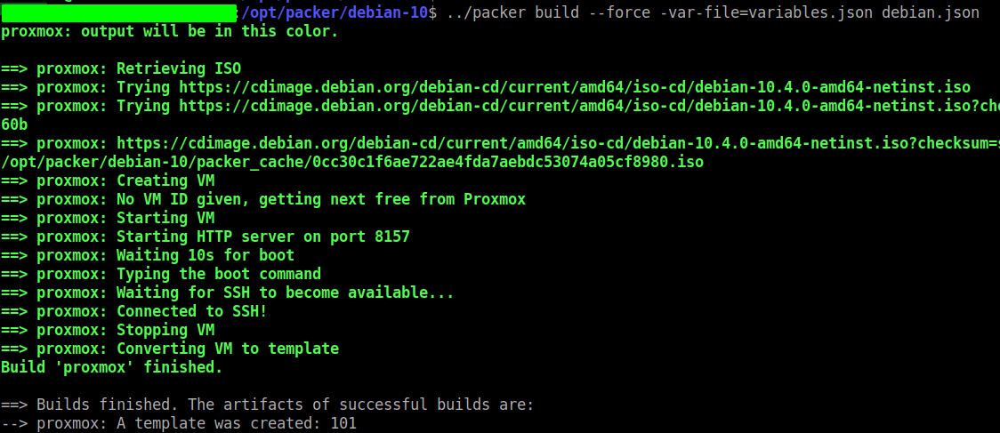

<h1>Introducción</h1>
El builder de proxmox para packer, nos permitirá crear un template as a code desde un archivo .json. Adicionalmente para poder descargar el archivo desatendido durante la instalación, packer levantara un servidor web provisional con un puerto random.
<h1></h1>

<h1>Requisitos</h1>
La máquina desde donde ejecutaremos Packer, tiene que cumplir los siguiente requisitos:
<ul>
 	<li>Acceso a la consola de proxmox vía web (por defecto por el puerto 8006)</li>
 	<li>Para hacerlo fácil, packer tiene que estar en la misma VLAN en el cual provisionamos el template.</li>
 	<li>La VLAN anterior tendrá que tener DHCP</li>
</ul>
&nbsp;
<h1>Instalación</h1>
Primero descargamos packer de la web oficial:

https://www.packer.io/downloads

Descargamos, descomprimimos y ubicamos en el siguiente directorio:
<pre>/opt/packer/packer</pre>
<h1>Configuración</h1>
Descargamos los ficheros .json de la siguiente ubicación:
<pre>cd /opt/packer/
git clone https://github.com/danielcastropalomares/packer-pmx-debian10.git</pre>
En este ejemplo no necesitamos descargar previamente la ISO, ya que lo realizará packer y la subirá automáticamente a proxmox. Necesitamos conocer la URL de descarga y también el checksum de esta:
<pre>"iso_checksum": "sha256:ab3763d553330e90869487a6843c88f1d4aa199333ff16b653e60e59ac1fc60b", 
"iso_storage_pool": "local", 
"iso_url": "https://cdimage.debian.org/debian-cd/current/amd64/iso-cd/debian-10.4.0-amd64-netinst.iso",

</pre>
Lo único a modificar es cambiar el iso_storage_pool por el repositorios de ISO que tengas en tu caso:
<pre>"var_storage_pool": "local-lvm"</pre>
En el caso contrario que ya se disponga de la ISO descargada, sustituir las líneas anteriores por:
<pre>"iso_file": "local:iso/debian-10.4.0-amd64-netinst.iso",
</pre>
A nivel variables a modificar:
<pre>{

  "proxmox_username": "root@pam",                            
  "proxmox_password": "XXXXXXXXXXXXXX",                      
  "var_proxmox_url": "https://192.168.0.222:8006/api2/json", 
  "var_ssh_password": "XXXXXXXXXXXXXX,                       
  "var_ssh_username": "root",                                
  "var_template_name": "debian-10-template",                 
  "var_storage_pool": "local-lvm"                            
}
</pre>
<ul>
 	<li>proxmox_username: usuario con acceso a la consola web de proxmox.</li>
 	<li>proxmox_password: password para acceder la consola web de proxmox.</li>
 	<li>var_proxmox_url:  URL consola web proxmox.</li>
 	<li>var_ssh_password: password que se utilizará para conectarse una vez finalizada la instalación de Debian.</li>
 	<li>var_ssh_username: usuario que se utilizará para conectarse vía SSH una vez finalizada la instalación de Debian.</li>
 	<li>var_template_name: nombre final del template.</li>
 	<li>var_storage_pool: ubicación del storage pool donde se ubican las ISO.</li>
</ul>
Durante la instalación desatendida, se creara tanto el password de root como un usuario adicional, a partir de ahora lo llamaremos "user". 

En mi caso, al tratarse de una POC, utilizare el mismo password tanto para root como para el usuario "user". Para generar el hash del password de root y del usuario durante la instalación:
<pre>printf "3LyWccqNZ63ZNtnY" | mkpasswd -s -m md5
</pre>
Lo configuramos en el fichero http/preseed.cfg, tanto para el usuario como root como user:
<pre>d-i passwd/root-password-crypted password $1$DHUlEcsI$D/lF6448SdWmkFceDVD6E0
d-i passwd/user-password-crypted password $1$DHUlEcsI$D/lF6448SdWmkFceDVD6E0
</pre>
Aqui indicaremos el nombre que le querremos dar al nuevo usuario, en mi caso "user":
<pre>d-i passwd/user-fullname string user 
d-i passwd/username string user

</pre>
Para iniciar el build:
<pre>/opt/packer/debian-10$ ../packer build --force -var-file=variables.json debian.json.
</pre>

Ahora podremos seguir el avance de la instalación con la consola de proxmox.
